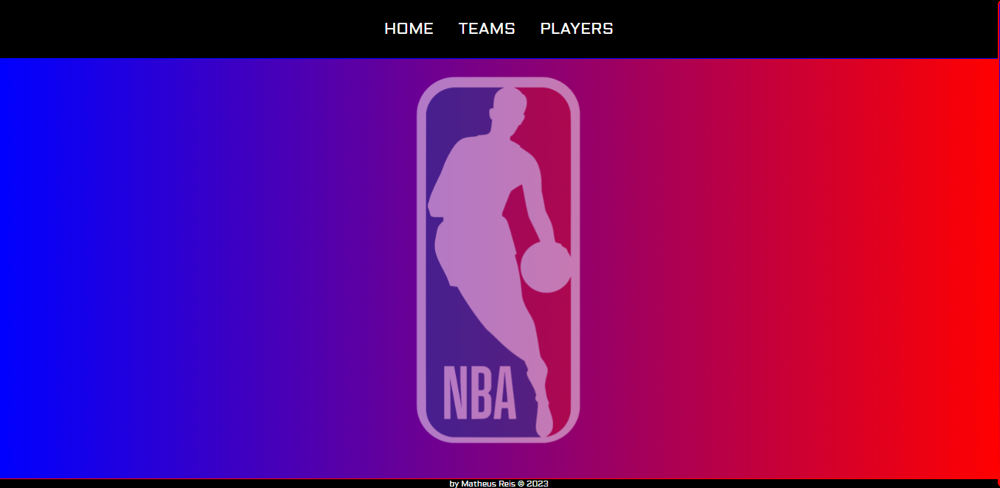

# NBA Info

- [Link do site](https://nba-info-api.vercel.app/)

---

## Sobre

Este projeto tem como objetivo a criação de um site consumindo uma API desejada (escolhi a https://app.balldontlie.io/), além da utilização de web components e rotas (routes).
O objetivo deste projeto é colocar em prática os conhecimentos adquiridos no curso do [Senai Jandira](https://jandira.sp.senai.br/). 

---

## Tecnologias Utilizadas

- HTML
- CSS
- JavaScript
- Web Components
- Responsividade
- Markdown
- Figma
- Router

---

## Protótipo do site (figma)

A prototipação do site foi inteiramente realizada no figma, tanto a parte para desktop, quanto a mobile. Seguindo um padrão de paleta de cores e tamanhos padronizados.

- [Clique aqui para ver o protótipo no figma](https://www.figma.com/file/tOC6RI4hBGQPGCIc7JLpO5/NBA-Info?type=design&node-id=0-1&t=Zmd5dzVWJp8gwVtV-0)

---

## Autoavaliação 

 - [x] Documentou problemas, se encontrado, para futuras consultas?
 - [x] Foi criado o layout no figma?
 - [x] A página foi construída seguindo o planejado no Figma?
 - [x] A página funciona em dispositivos diferentes?
 - [x] Foi consumida a API escolhida?
 - [x] Foi criado web componentes?
 - [x] Foi criado um padrão de roteamente para as paginas?
 - [x] As funções foram criadas seguindo à boa prática de responsabilidade única?
 - [x] Quando possível, foi criado funções puras?
 - [x] O projeto está publicado?
 - [x] Foi criado o arquivo README.md?

---

## Autor

- [Matheus Alves Reis da Silva](https://github.com/MatheusAlves099)

---

## Professor

- [Fernando Leonid](https://github.com/fernandoleonid)

---